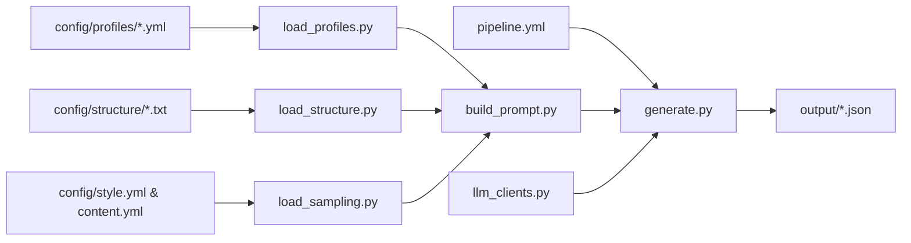

# Configuration-Driven Synthetic Cancer Document Generation

Configurable pipeline for generating high fidelity synthetic cancer documents that can be turned into training data.

## Overview

The pipeline is configured from `pipeline.yml` and run from `generate.py`.

The following components can be used to add deeper customisation for dynamically creating synthetic data generation prompts:
- Probabilistic sampling from style and content requirements:
  - `./config/style.yml`
  - `./config/content.yml`
  - `./utils/load_sampling.py`
- Primary cancer profiles that define topographies, morphology, and molecular biomarkers:
  - `./config/profiles/*.yml`
  - `./utils/load_profiles.py`
- Example structures that are hand-crafted based on real clinical document formats:
  - `./config/structure/*.txt`
  - `./utils/load_structure.py`
- Prompt builder that assembles all components into LLM prompts:
  - `./utils/build_prompt.py`

The prompt is passed to an LLM API. Different clients can be defined via `./utils/llm_clients.py`.

## Flowchart



## Quick Start

### 1. Configure the pipeline

Edit `pipeline.yml` to configure LLM provider (currently gemini or local), profile sampling mode (random/sequential), prompt configuration, and output directory. If using Gemini, configure `.env` with API key (see `.env.example`).


### 2. Run the generator

```bash
python generate.py
```

Note: while in development, verbose logs are output to `debug.log`.

### 3. View outputs

Generated documents are saved to `./output/{subdirectory}/`:

```json
{
  "doc_id": "narrative_lung_001_20251012_143022_477",
  "doc_name": "synth",
  "prompt": "... complete prompt text ...",
  "content": "... generated clinical document ..."
}
```

Note: when `llm.enabled: false` in `pipeline.yml`, only prompts are saved (no `content` field).

## Planned Features

- ?Cleaner primary configuration instead of pipeline.yml 
- Add testing for configuration
- Add Bedrock client
- Add option to directly generate training data 
- Better logging/error handling (currently skips)
- Small refactor in generate.py for sequential/random docs